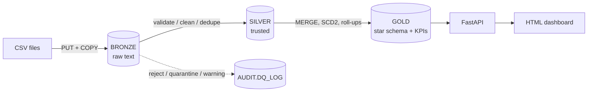

# Bank of New York – Real-Time Merchant Settlement Intelligence Platform

Capstone 2: explains the gap between **successful payments** and **settled amounts**, flags merchants with
abnormal settlement behaviour, and exposes it through an API and a web dashboard.



**Stack:** Snowflake · Python · FastAPI + Pydantic · Chart.js · pytest · Docker · GitHub Actions / GitLab CI

👉 **Start here: [GUIDE.md](GUIDE.md)** – step-by-step instructions with the theory behind every phase.

## Quick start
```powershell
python -m venv .venv; .venv\Scripts\activate
pip install -r requirements-dev.txt
copy .env.example .env                      # fill in (see GUIDE.md phase 1)
python -m common.snowflake_conn             # test connection
python -m pipeline.generate_data --batch 1
python -m pipeline.run_pipeline --init
uvicorn api.main:app --reload               # http://localhost:8000  and  /docs
pytest -v
```

## Project map
| Path | What | Brief task |
|---|---|---|
| `docs/01..03` | business spec, technical spec, Gherkin scenarios | Task 1 |
| `docs/04_data_model.md`, `sql/` | data model, grain, DDL, transforms | Task 2 |
| `pipeline/` | generator, ingestion, Silver rules, orchestration | Task 2 |
| `api/`, `common/kpi.py` | FastAPI endpoints + KPI formulas | Task 3A/B |
| `frontend/index.html` | dashboard | Task 3C |
| `tests/` | unit, API contract, data model tests | Task 4A/B/C |
| `docs/05_security.md` | security review | Task 4D |
| `Dockerfile`, `.gitlab-ci.yml`, `.github/workflows/`, `docs/06_deployment.md` | deployment | Task 4E |

## Hidden data problems → solution
| Problem | Solution |
|---|---|
| One-to-many settlement | settlements summed per transaction **before** joining (`GOLD.V_TXN_SETTLEMENT`) |
| Late events | keep `event_ts` (business) and `ingestion_ts` (processing); flag `IS_LATE` |
| Out-of-order events | `EVENT_SEQ` ordered by `event_ts`, not arrival |
| Merchant risk changes | SCD Type 2 `DIM_MERCHANT`, join on transaction date |
| Data-quality issues | REJECT / QUARANTINE / WARNING in `AUDIT.DQ_LOG`, business exceptions in `V_SETTLEMENT_EXCEPTIONS` |
