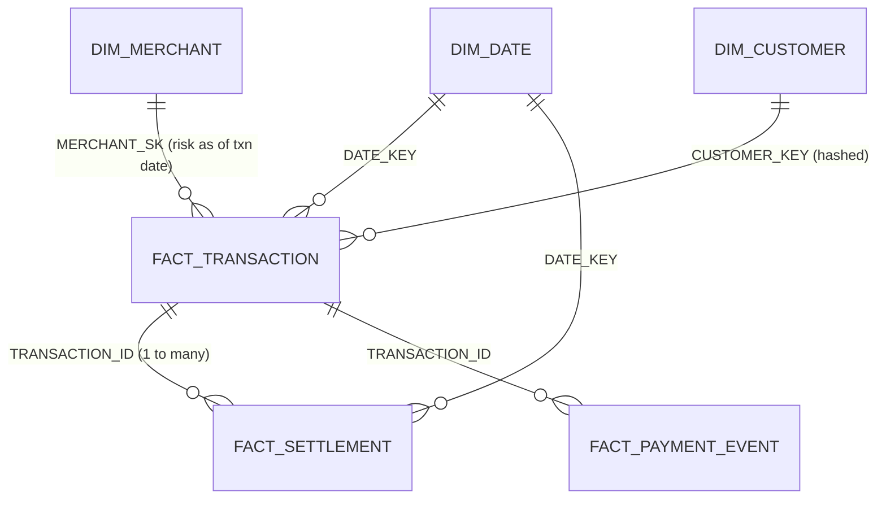

# 4. Data Model (Gold star schema)

## Grain of every table
| Table | One row = | Key |
|---|---|---|
| DIM_DATE | one calendar day | DATE_KEY (yyyymmdd) |
| DIM_MERCHANT | one merchant **per risk period** (SCD Type 2) | MERCHANT_SK (surrogate); unique MERCHANT_ID + EFFECTIVE_FROM |
| DIM_CUSTOMER | one customer | CUSTOMER_KEY = sha256(customer_id) |
| FACT_TRANSACTION | one payment transaction attempt | TRANSACTION_ID |
| FACT_SETTLEMENT | one settlement record | SETTLEMENT_ID |
| FACT_PAYMENT_EVENT | one payment lifecycle event | EVENT_ID |
| V_TXN_SETTLEMENT (view) | one transaction with its settlements rolled up | TRANSACTION_ID |
| AGG_MERCHANT_DAILY | one merchant per transaction date | TXN_DATE + MERCHANT_ID |

## Why this model
- **Separate settlement fact** – settlement is 1-to-many with transaction. Keeping it at its own grain and
  rolling it up per transaction *before* joining (V_TXN_SETTLEMENT) avoids double counting.
- **SCD2 merchant dimension** – risk is historical. The fact stores the MERCHANT_SK valid on the
  transaction date, plus `RISK_LEVEL_AT_TXN` for easy reading.
- **Event fact with two times** – `EVENT_TS` (business time, used for reporting and ordering → `EVENT_SEQ`)
  and `INGESTION_TS` (processing time, used for lateness → `is_late`).
- **Aggregate table** – the API reads tiny pre-computed rows, so it is fast and cheap. It is rebuilt only
  for dates touched by new data (incremental).
- **Hashed customer** – analytics does not need the real customer id (PII minimisation).

## Constraints, keys, indexes (DuckDB)
- **Primary keys, foreign keys, UNIQUE, NOT NULL and CHECK are all enforced** by DuckDB.
  For example a settlement cannot point to a transaction that is not in `fact_transaction`, and
  `settlement_amount` cannot be negative. The tests in `tests/test_data_model.py` prove it as well.
- **Indexes:** `fact_transaction(date_key)`, `fact_transaction(merchant_id)`, `fact_settlement(transaction_id)`
  speed up the filters and joins the API uses. (Primary keys are indexed automatically.)
- **Partitioning:** not needed at this size. In a large warehouse you would partition facts by date.

## Layers
| Layer | Tables | Rule |
|---|---|---|
| BRONZE | MERCHANT, TRANSACTIONS, SETTLEMENTS, PAYMENT_EVENTS | text only, append-only, + SOURCE_FILE, LOAD_TS |
| SILVER | same four, typed | validated, de-duplicated, upserted |
| GOLD | dims, facts, AGG, views | business logic |
| AUDIT | dq_log, watermark, loaded_files, pipeline_runs | control + monitoring |

**Staging tables:** the BRONZE tables are the staging (landing) area: raw copies of each file.
During the Silver step, each source is first checked in a temporary table (`chk_transactions`, ...) and only
the good rows are then upserted into Silver, all in one transaction.

**Views for investigation:** `gold.v_txn_settlement` (one row per transaction with its settled amount, gap,
delay in minutes and SLA flag) and `gold.v_settlement_exceptions` (unsettled, pending, partly settled or
**delayed** settlements).
