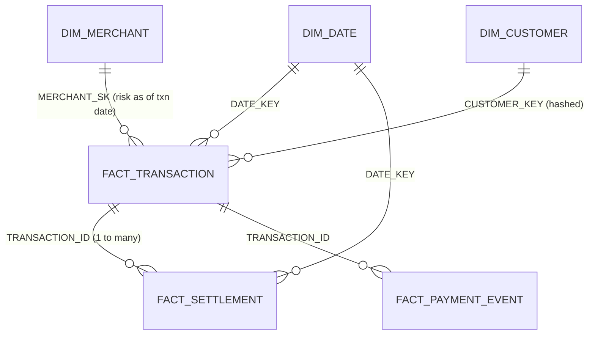

# 4. Data Model (Gold star schema)

## Grain of every table
| Table | One row = | Key |
|---|---|---|
| DIM_DATE | one calendar day | DATE_KEY (yyyymmdd) |
| DIM_MERCHANT | one merchant **per risk period** (SCD Type 2) | MERCHANT_SK (surrogate); unique MERCHANT_ID + EFFECTIVE_FROM |
| DIM_CUSTOMER | one customer | CUSTOMER_KEY = SHA2(customer_id) |
| FACT_TRANSACTION | one payment transaction attempt | TRANSACTION_ID |
| FACT_SETTLEMENT | one settlement record | SETTLEMENT_ID |
| FACT_PAYMENT_EVENT | one payment lifecycle event | EVENT_ID |
| V_TXN_SETTLEMENT (view) | one transaction with its settlements rolled up | TRANSACTION_ID |
| AGG_MERCHANT_DAILY | one merchant per transaction date | TXN_DATE + MERCHANT_ID |

## Why this model
- **Separate settlement fact** – settlement is 1-to-many with transaction. Keeping it at its own grain and
  rolling it up per transaction *before* joining (V_TXN_SETTLEMENT) avoids double counting.
- **SCD2 merchant dimension** – risk is historical. The fact stores the MERCHANT_SK valid on the
  transaction date, plus `RISK_LEVEL_AT_TXN` for easy reading.
- **Event fact with two times** – `EVENT_TS` (business time, used for reporting and ordering → `EVENT_SEQ`)
  and `INGESTION_TS` (processing time, used for lateness → `IS_LATE`).
- **Aggregate table** – the API reads tiny pre-computed rows, so it is fast and cheap. It is rebuilt only
  for dates touched by new data (incremental).
- **Hashed customer** – analytics does not need the real customer id (PII minimisation).

## Constraints, keys, "indexes" in Snowflake
- PK / FK / UNIQUE are **declared** (documentation + BI tools) but **not enforced** by Snowflake.
  `NOT NULL` **is** enforced. `CHECK` does not exist.
  → Uniqueness is guaranteed by MERGE in the pipeline and **proved** by `tests/data_model`.
- Snowflake has **no indexes**. It prunes micro-partitions automatically. For very large facts you would
  add `CLUSTER BY (DATE_KEY)` (commented in the DDL – not worth the cost for small data).

## Layers
| Layer | Tables | Rule |
|---|---|---|
| BRONZE | MERCHANT, TRANSACTIONS, SETTLEMENTS, PAYMENT_EVENTS | text only, append-only, + SOURCE_FILE, LOAD_TS |
| SILVER | same four, typed | validated, de-duplicated, upserted |
| GOLD | dims, facts, AGG, views | business logic |
| AUDIT | DQ_LOG, WATERMARK, PIPELINE_RUNS | control + monitoring |
